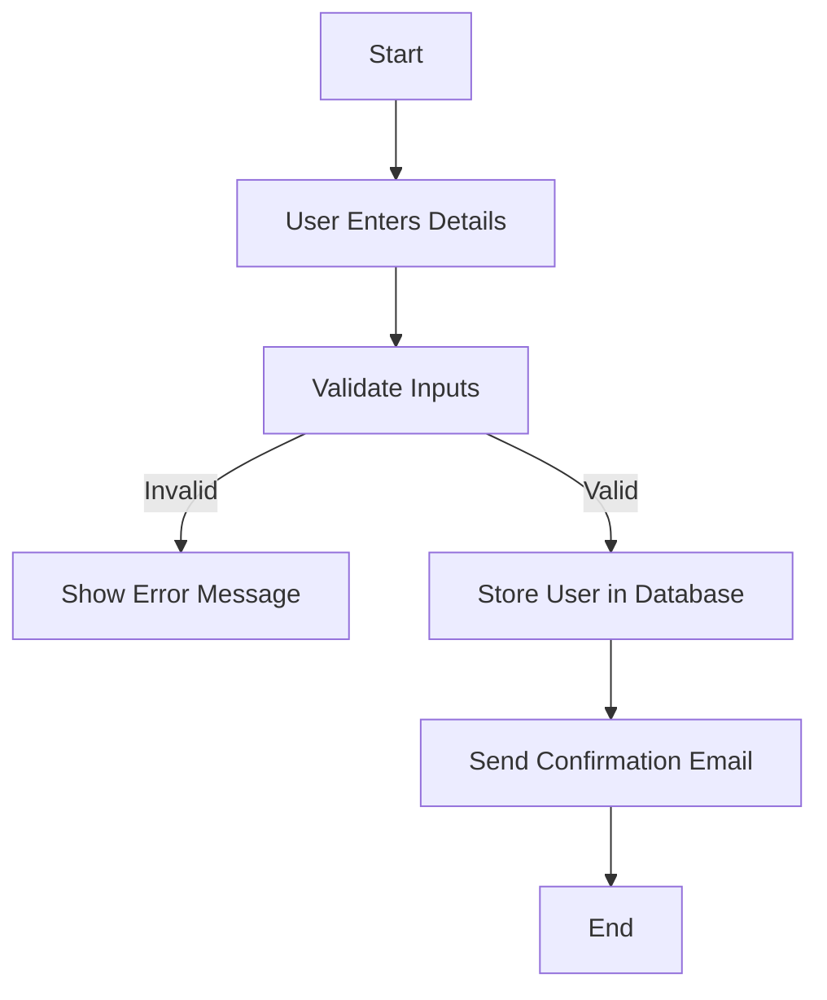
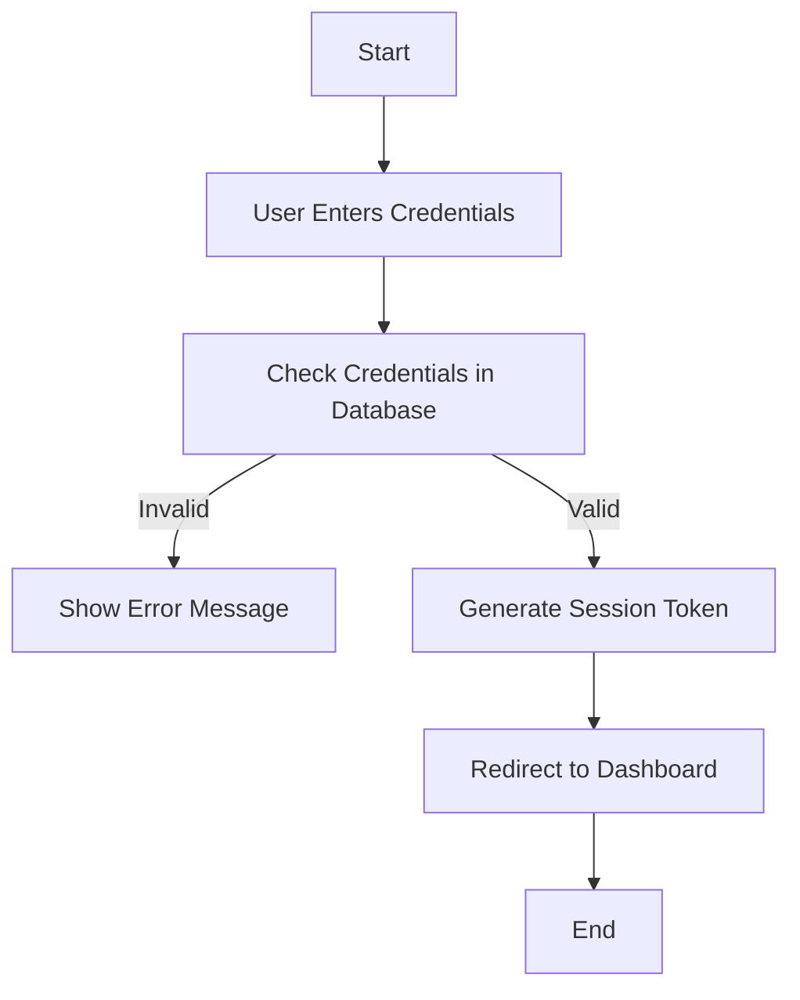
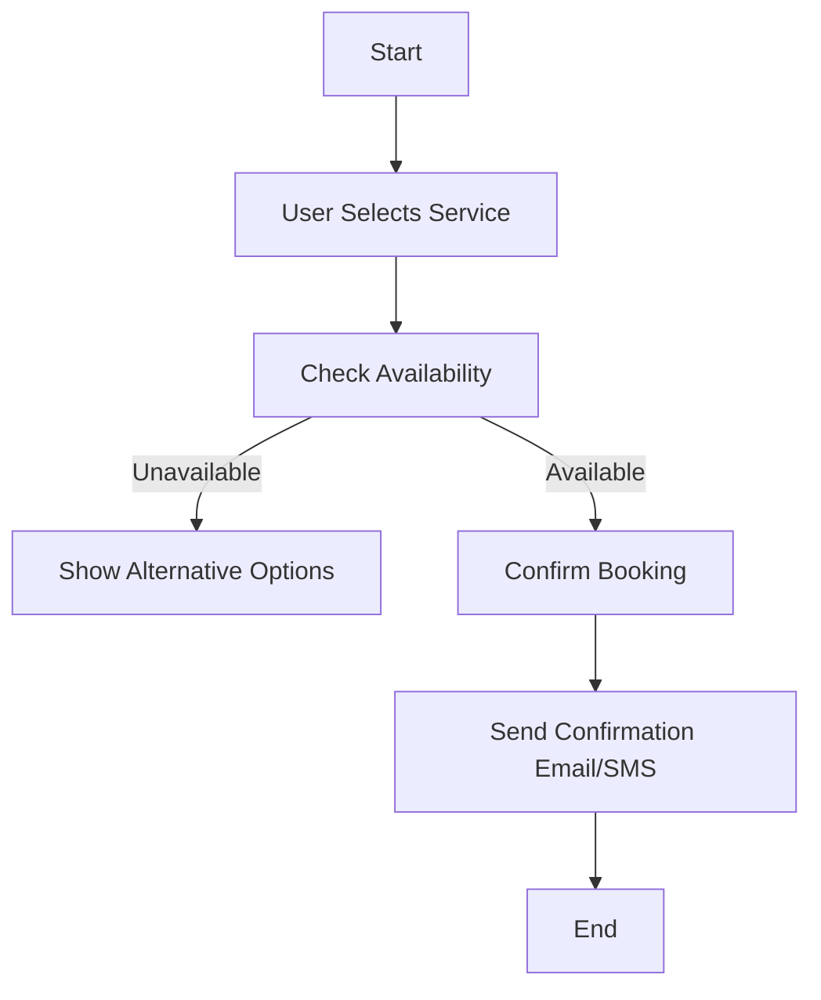
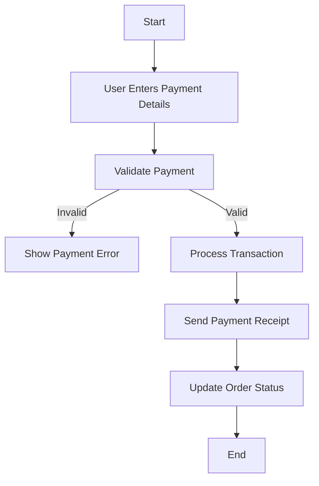
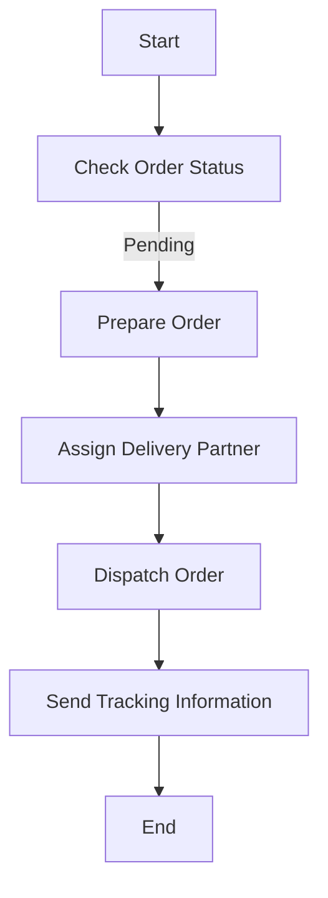
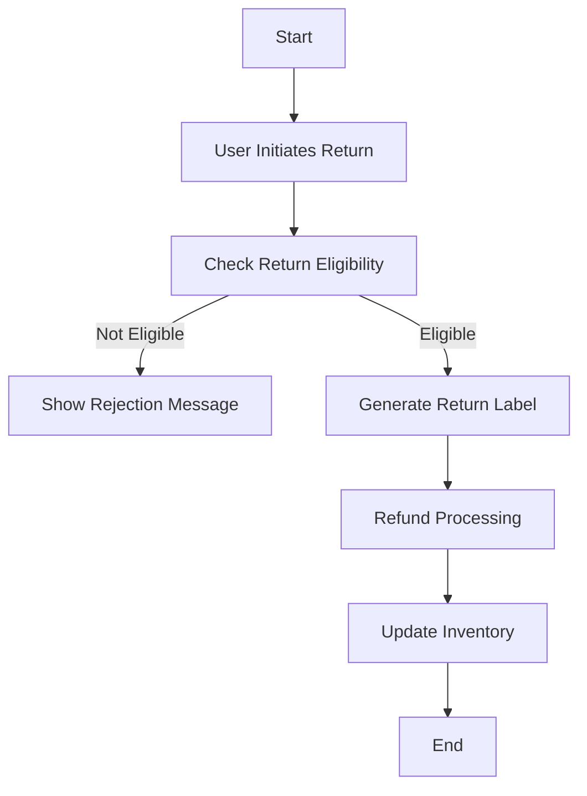
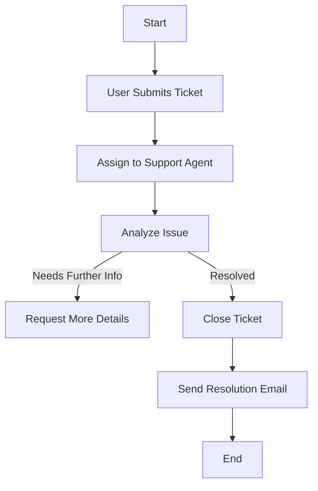
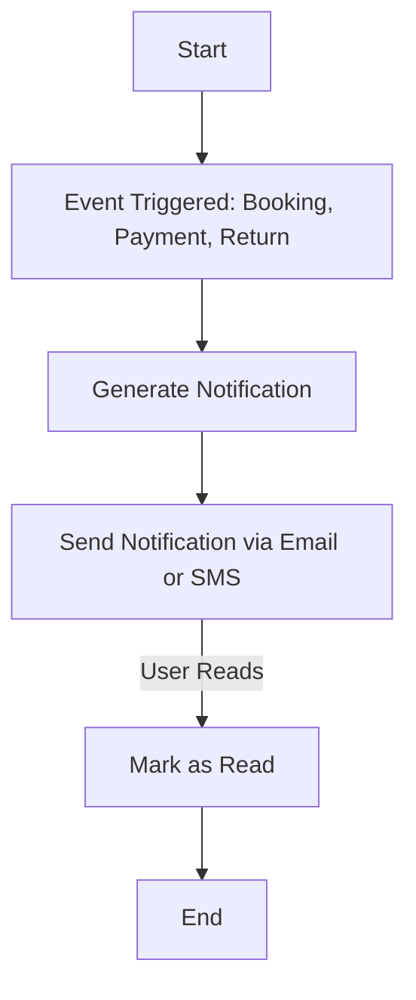

### **1. User Registration Workflow**

#### **Explanation**
- Ensures all user details are validated before storage.
- Sends a confirmation email to verify identity.
- Addresses concerns about **data integrity** and **user authentication**.

---

### **2. Login Process**

#### **Explanation**
- Uses authentication validation before granting access.
- Enhances **security** by generating session tokens.
- Prevents **unauthorized access** with proper error handling.

---

### **3. Booking a Service**

#### **Explanation**
- Ensures users cannot book unavailable services.
- Implements **parallel actions** to notify users via multiple channels.
- Addresses **user experience** and **reliability**.

---

### **4. Payment Processing**

#### **Explanation**
- Prevents transactions with **invalid details**.
- Ensures **real-time order updates** after successful payment.
- Enhances **financial security** and **record-keeping**.

---

### **5. Order Fulfillment**

#### **Explanation**
- Ensures **seamless order fulfillment**.
- Provides **real-time tracking** to users.
- Addresses concerns about **delivery reliability**.

---

### **6. Processing a Return Request**

#### **Explanation**
- Ensures **fraud prevention** by validating return eligibility.
- **Automates refund** and inventory update processes.
- Improves **customer satisfaction**.

---

### **7. Customer Support Ticketing**

#### **Explanation**
- Streamlines **customer service workflows**.
- Ensures **efficient ticket resolution**.
- Provides **real-time communication** between users and support agents.

---

### **8. Notification Management**

#### **Explanation**
- Ensures **automated and timely notifications**.
- Reduces **manual follow-ups**.
- Improves **communication and user engagement**.
