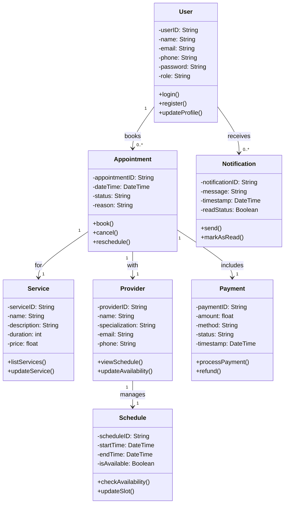

# Class Diagram



## Explanation

- User interacts with the system to book and manage appointments.
- Appointment is central, connecting users, services, providers, and payment.
- Service represents various offerings like dental consultation, therapy, etc.
- Provider is the professional offering services (e.g., doctor, therapist).
- Schedule is tightly associated with each provider to track availability.
- Payment handles financial transactions tied to appointments.
- Notification alerts users about appointments and updates.
- Multiplicities (e.g., 1, 0.., 1..) describe how many instances are involved in each relationship.


```mermaid
classDiagram
    class Repository {
        <<interface>>
        +save(entity)
        +find_by_id(id)
        +find_all()
        +delete(id)
    }

    class InMemoryUserRepository {
        +save(user)
        +find_by_id(id)
        +find_all()
        +delete(id)
    }

    class FileSystemUserRepository {
        +save(user)
        +find_by_id(id)
        +find_all()
        +delete(id)
    }

    class DatabaseUserRepository {
        +save(user)
        +find_by_id(id)
        +find_all()
        +delete(id)
    }

    Repository <|-- InMemoryUserRepository
    Repository <|-- FileSystemUserRepository
    Repository <|-- DatabaseUserRepository

