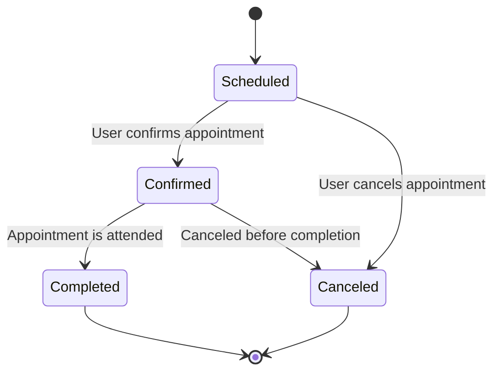
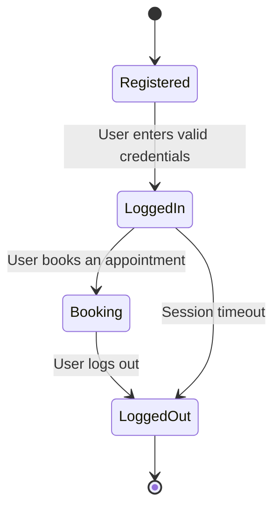
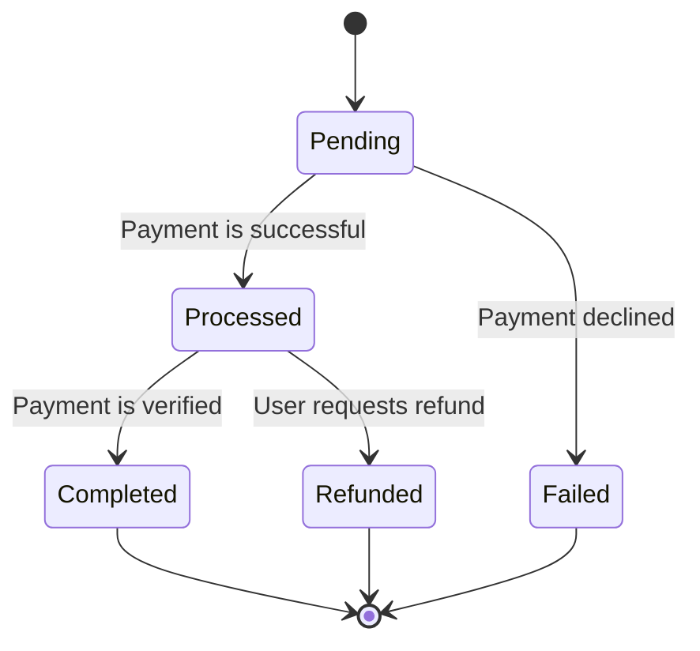
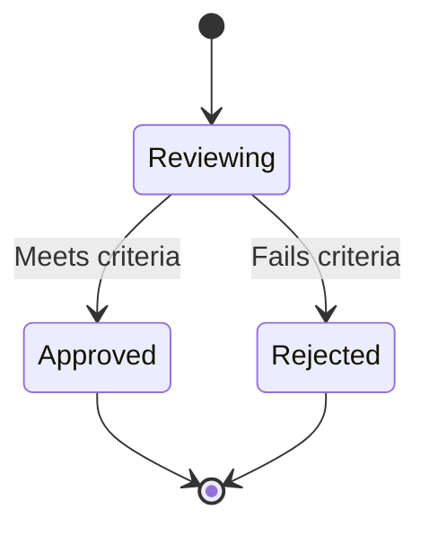
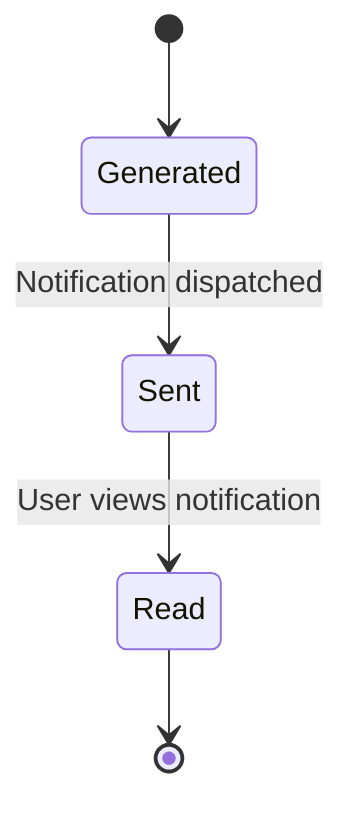
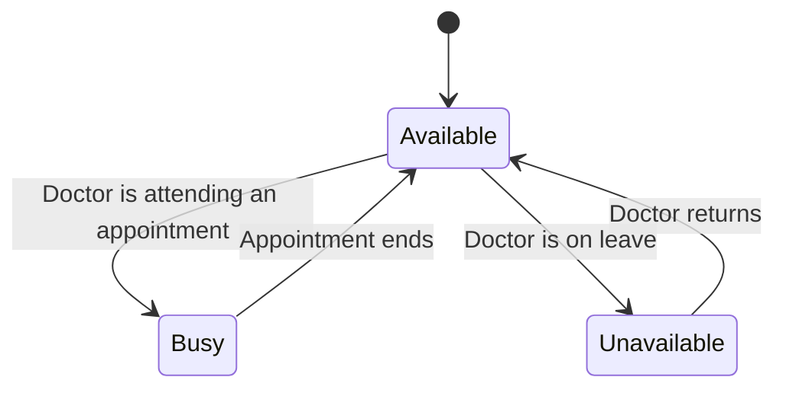
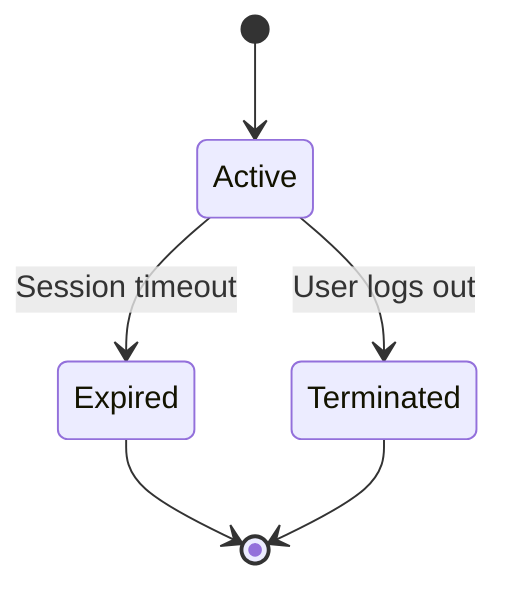
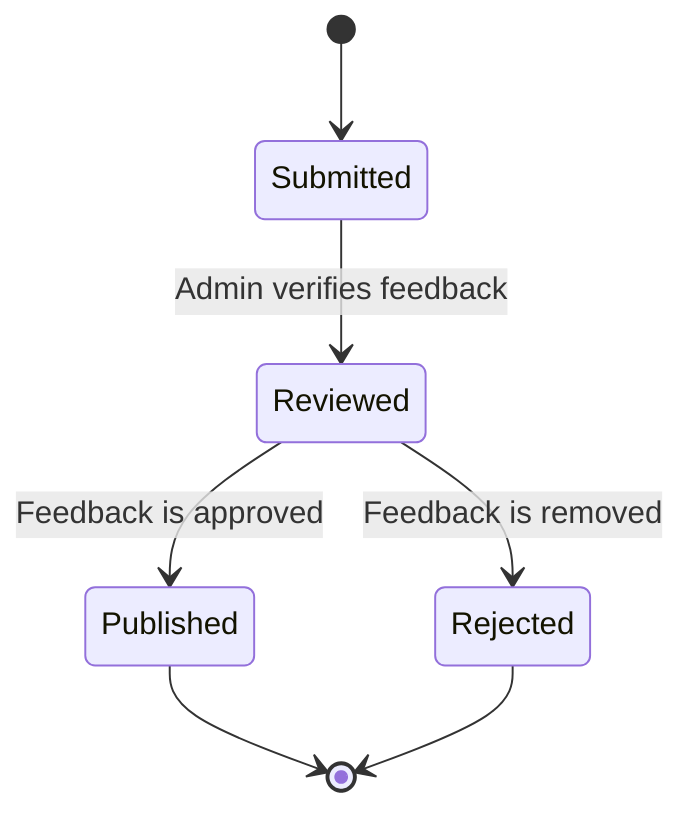

## **Object State Modeling with State Transition Diagrams**

### **1. Appointment State Transition**

**Explanation:**
- The **appointment** starts as **"Scheduled"** when a user books it.
- It moves to **"Confirmed"** when the user or system verifies it.
- If attended, it transitions to **"Completed"**; otherwise, it can be **"Canceled"** before completion.
- This addresses **FR-001: Users can schedule, confirm, and cancel appointments**.

---

### **2. User Account State Transition**

**Explanation:**
- The **user account** starts in the **"Registered"** state.
- After **logging in**, users can perform actions like booking an appointment.
- If the user logs out or the session expires, it returns to **"LoggedOut"**.
- This satisfies **FR-002: Users must register, log in, and log out**.

---

### **3. Payment State Transition**

**Explanation:**
- Payments start in **"Pending"**.
- If successful, they move to **"Processed"**, and then **"Completed"**.
- If the transaction **fails**, it moves to **"Failed"**.
- Users can request a **refund** if eligible.
- This supports **FR-003: Secure payment processing and refunds**.

---

### **4. Admin Review State Transition**

**Explanation:**
- The **admin reviews** appointment requests.
- If valid, the state transitions to **"Approved"**; if not, it is **"Rejected"**.
- This ensures **FR-004: Admins must approve or reject appointments**.

---

### **5. Notification State Transition**

**Explanation:**
- Notifications are **generated** automatically.
- Once **sent**, users can view them, transitioning to **"Read"**.
- This implements **FR-005: Users receive notifications for appointment updates**.

---

### **6. Doctor Availability State Transition**

**Explanation:**
- Doctors start as **"Available"**.
- They become **"Busy"** when attending an appointment.
- If they take time off, their state transitions to **"Unavailable"**.
- This supports **FR-006: Track doctor availability for scheduling**.

---

### **7. System Session State Transition**

**Explanation:**
- The session begins as **"Active"**.
- If the user remains idle, it **"Expires"**.
- If the user logs out, it transitions to **"Terminated"**.
- This ensures **FR-007: Automatic session expiration for security**.

---

### **8. Feedback State Transition**

**Explanation:**
- Users **submit feedback**, which is **reviewed** by an admin.
- If approved, it is **"Published"**; otherwise, it is **"Rejected"**.
- This meets **FR-008: Users can submit feedback, which admins moderate**.
