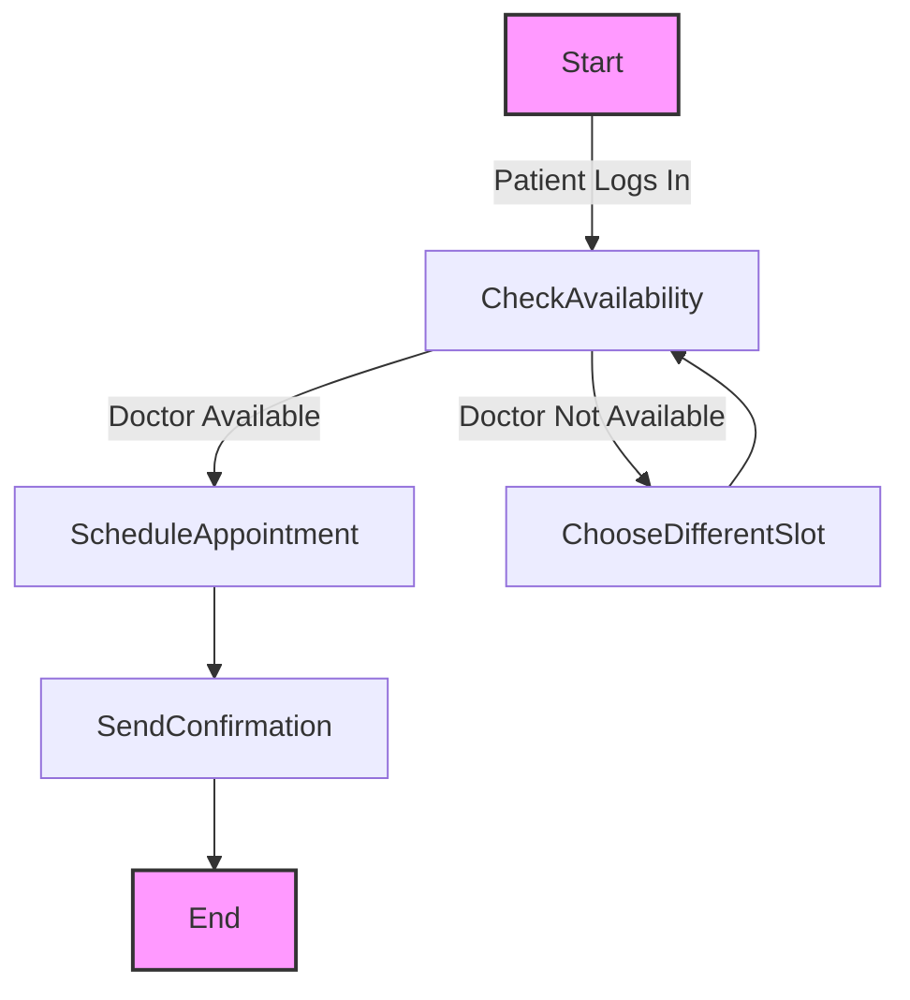
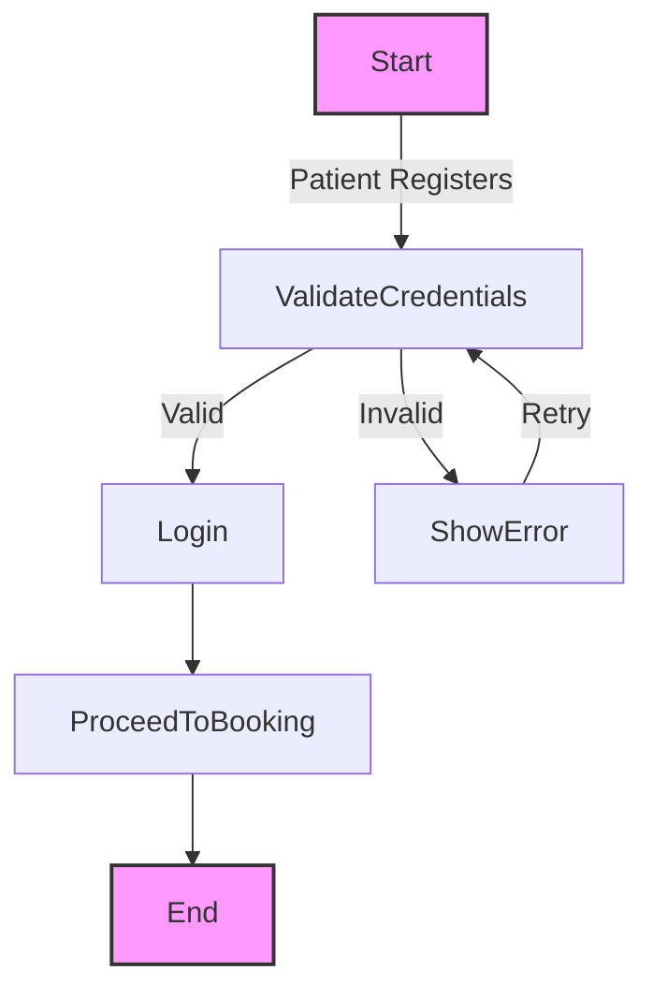
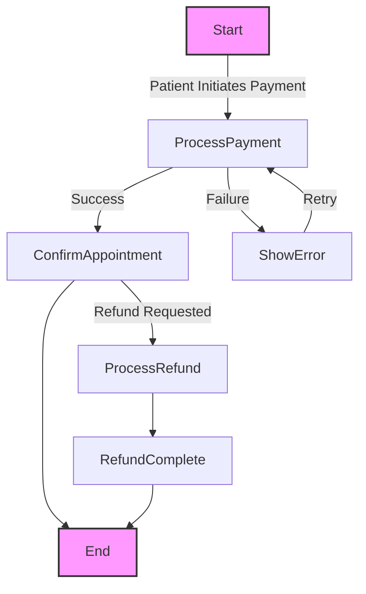
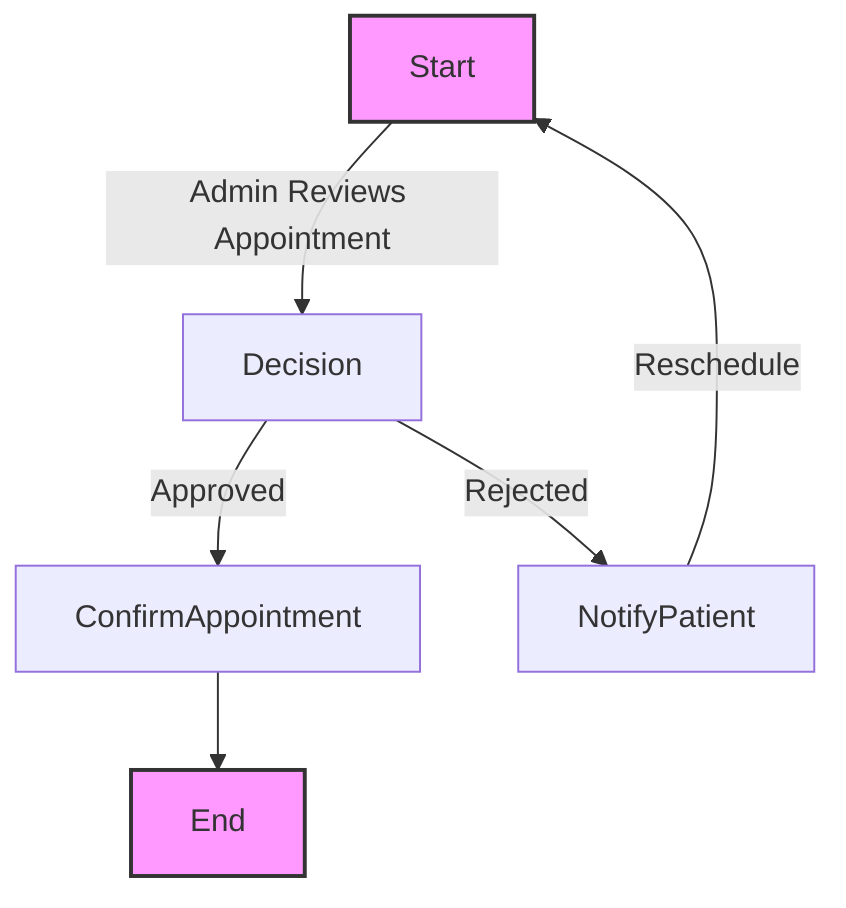
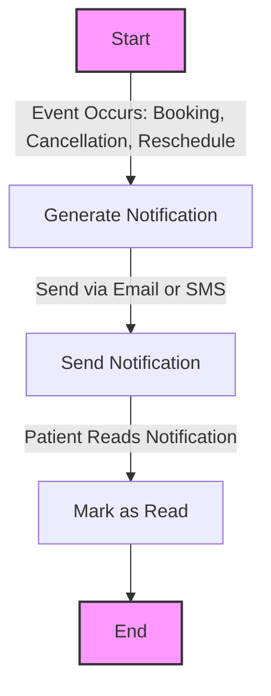
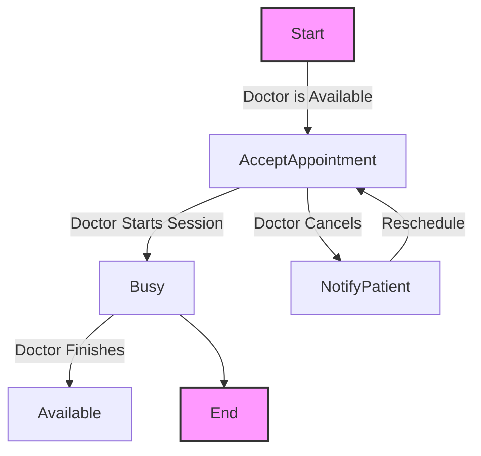
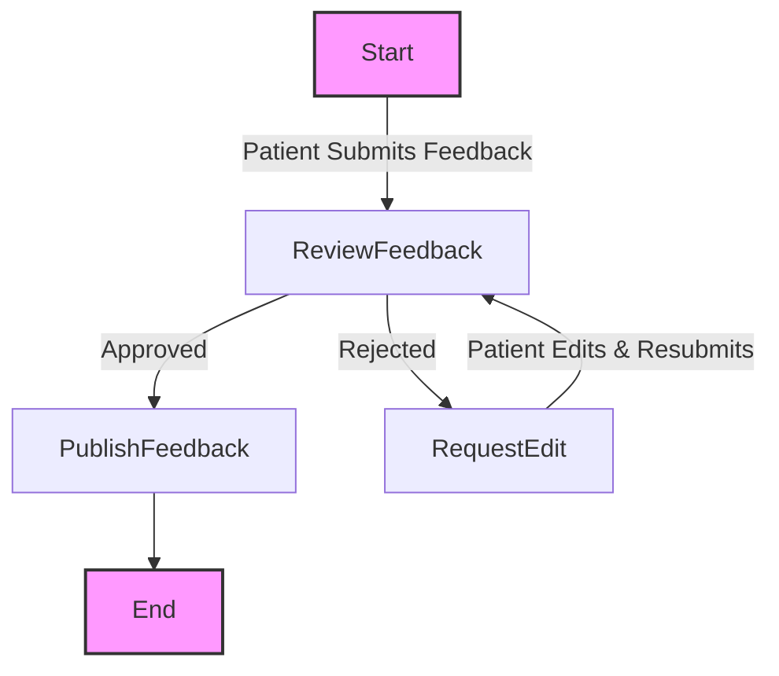

# **Activity Diagrams for Critical Objects in the Online Appointment System**  

## **1. Appointment Booking Process**  
### **Explanation:**  
- The process begins when a **patient logs in** and selects an available time slot.  
- The system checks the doctor's availability.  
- If available, the **appointment is scheduled** and the **patient receives confirmation**.  
- If the doctor is unavailable, the patient must **choose a different slot**.  

---

## **2. Patient Registration & Login Flow**  
### **Explanation:**  
- A **new patient** registers in the system.  
- The system **validates the credentials**.  
- If valid, the **patient logs in** and can proceed to book an appointment.  
- If invalid, an **error message** is displayed.  

---

## **3. Payment Processing Flow**  
### **Explanation:**  
- The patient initiates **payment for an appointment**.  
- The system processes the payment.  
- If **successful**, the appointment is confirmed.  
- If **failed**, the patient is prompted to try again or choose a different method.  
- Refunds can be requested if needed.  

---

## **4. Admin Reviewing Appointments**  
### **Explanation:**  
- Admins can **approve** or **reject** an appointment request.  
- If rejected, the patient is notified and asked to **reschedule**.  
- If approved, the system moves the appointment to **confirmed status**.  

---

## **5. Notification Management Flow**  
### **Explanation:**  
- The system **generates notifications** when a patient books, cancels, or reschedules an appointment.  
- Notifications are **sent via email/SMS** and marked as read when viewed.  

---

## **6. Doctor Availability Management**  
### **Explanation:**  
- A doctor is **available** by default.  
- If they start a session, they become **busy**.  
- If they **cancel or reschedule** an appointment, their availability changes accordingly.  

---

## **7. Patient Feedback & Review Process**  
### **Explanation:**  
- After an appointment, patient can **submit feedback**.  
- The system **reviews** feedback before publishing it.  
- If rejected, the patient may be asked to **edit and resubmit**.  

